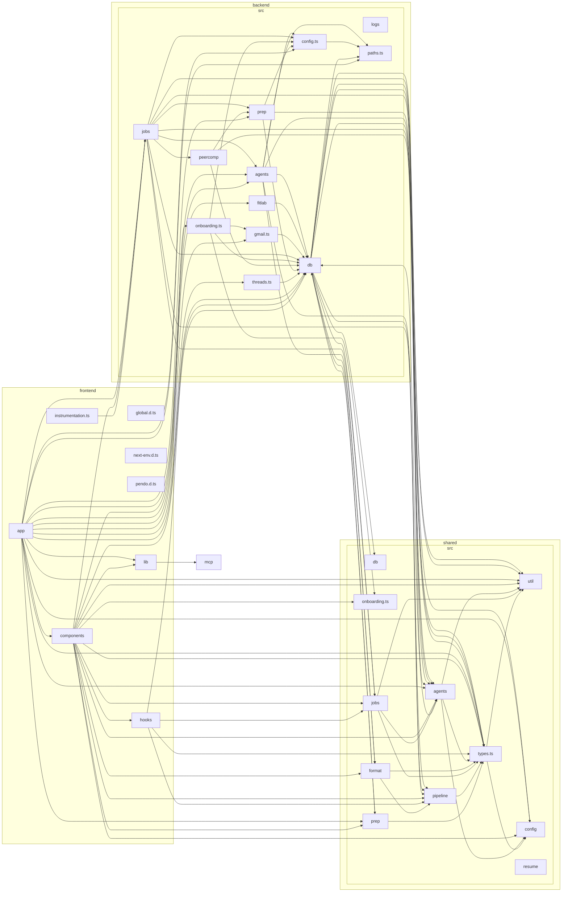

# Architecture diagram

<!-- AUTO-GENERATED — do not edit by hand. Run `npm run diagram:arch` to regenerate. Source of truth: the import graph itself. -->

High-level module dependency graph, collapsed to one box per workspace sub-folder
(`frontend/*`, `backend/src/*`, `shared/src/*`). An arrow means "imports from".

This is generated from the real import graph, so it is always correct and hard to read — use it
to spot structural drift in a diff. For orientation, read the hand-written
[overview](overview.md) instead.

