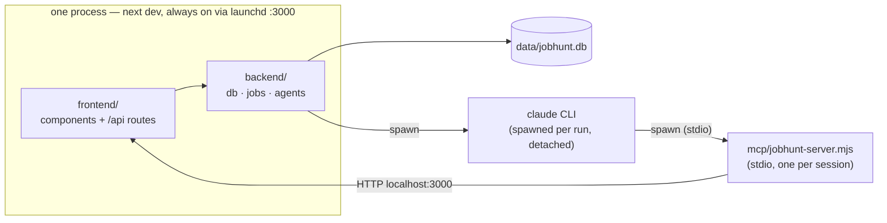
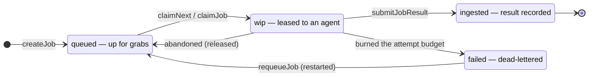

# How the system fits together

Hand-written, deliberately lossy. This is the picture you want when you're getting oriented or
deciding where new code goes. It shows **intent** — what each part is for — and is meant to be
re-drawn only when the shape genuinely changes, a few times a year at most.

Its counterpart, [`architecture.md`](architecture.md), is generated from the real import graph on
every push. That one is always correct and nearly unreadable: it's a drift alarm, not a map. When
the two disagree, the generated one is right about *what is*, and this one is right about *what was
meant* — which is the more interesting bug.

---

## Three processes, in a ring

The ring is the surprising part: **the app spawns the agent, the agent spawns an MCP server, and the
MCP server calls back into the app over HTTP.** CoWork never touches the database — every action it
takes is a round-trip through the app's own route handlers, which is why those routes are the
security and validation boundary rather than an afterthought.

The MCP hop buys three things a bare `curl` from the agent's Bash tool would not: typed tool schemas
the model can actually discover, the `x-jobhunt-thread` header stamped on every call (the heartbeat
that detects a dead agent in ~15 minutes), and the per-call trace in `thread_steps`.

---

## Two actors, one database

Every change is attributed to **You** (via the UI) or **CoWork** (via MCP). That attribution is not
cosmetic — the change log, the approval gate on inbox-derived edits, and the job ledger all key off
it.

---

## What owns what

| Component | Owns | Note |
|---|---|---|
| `backend/db/` | The 20-table schema and its hand-rolled bootstrap | No drizzle-kit — `index.ts` applies `CREATE IF NOT EXISTS` + `ADD COLUMN` itself |
| `backend/jobs/queue.ts` | The type-agnostic spine: create, lease, reap, ingest | Knows nothing about fit or tailoring |
| `backend/jobs/registry.ts` | The 12 job types and how each ingests its result | |
| `backend/jobs/enqueue/*` | *When* a job gets queued, and what it carries | Per-domain; mints the deterministic job ids |
| `backend/jobs/sweep.ts` | The self-heal tick every reader and claimer runs first | |
| `backend/jobs/subscribe.ts` | Where the jobs layer reacts to db-level events | See `db/stage-change.ts` |
| `backend/agents/` | CLI config, run journals, and `reconcile` (the DB-write funnel) | |
| `mcp/jobhunt-server.mjs` | 23 tools — CoWork's entire API surface | Zero-dependency, hand-rolled JSON-RPC |
| `instructions/` | The playbooks: CoWork's behaviour, in markdown, in git | Consumed by a live agent — keep in sync |
| `shared/` | Types, personas, coercion, formatting, the lease rule | Zero deps, browser-safe by contract |

---

## The job lifecycle

A claim is a **lease, not a lock**. Three independent signals decide a job was abandoned, fastest
first:

| Signal | Latency | Where |
|---|---|---|
| The agent claimed a different job | instant | `tryClaim` — an agent works one job at a time |
| Its session stopped making MCP calls | ~15 min | `reapStuckJobs`, via `threads.lastSeenAt` |
| The 60-minute lease expired | 60 min | the backstop, for a job with no session |

Every claim bumps `attempts`; three claims with no result dead-letters the job. That count is
**mechanical** — the app never trusts an LLM agent to report its own failure.

Two transitions return a job to `queued`, and they are not the same: **released** keeps the attempt
budget spent (so a job nobody can finish still walks down to the dead-letter), while **restarted**
resets it (so a hand requeue genuinely retries).

---

## Where state actually lives

"One SQLite DB is the source of truth" is the design, but six places hold state:

| Where | What | Durability |
|---|---|---|
| `data/jobhunt.db` | The source of truth — 20 tables | Backed up with the repo's data dir |
| `data/agent-jobs/*.jsonl` `.pid` `.err` | Per-type agent run journals | Overwritten each launch |
| `data/claude-code.mcp.json` | Generated MCP wiring for the CLI | Regenerated on demand |
| `ASSET_ROOT` | Résumés, prep folders | Cloud-synced — the one that corrupts in-place writes |
| `instructions/` | Playbooks | In git |
| `localStorage` | Chat transcripts | Browser-only; nothing server-side |

---

## The seams that are enforced

`npm run boundary` fails the build on any of these:

- `backend -/-> frontend` — the backend never reaches into the UI
- `shared -/-> backend` at runtime — `shared` ships to the browser (type-only imports are exempt)
- `shared -/-> node builtins` — same reason
- **no import cycles** — `db`, `jobs`, and `agents` were a ring until the stage-change event
  inverted the last edge

Route handlers are the only place that imports `@landed/backend` and turns it into HTTP. That is the
seam: keep them thin, and keep decisions on the backend side of it.
