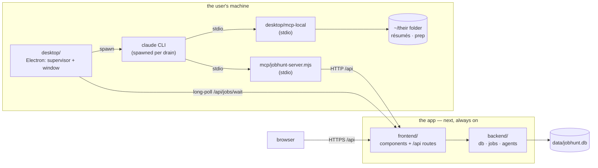
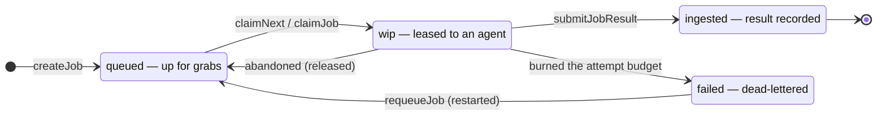

# How the system fits together

Hand-written, deliberately lossy. This is the picture you want when you're getting oriented or
deciding where new code goes. It shows **intent** — what each part is for — and is meant to be
re-drawn only when the shape genuinely changes, a few times a year at most.

Its counterpart, [`architecture.md`](architecture.md), is generated from the real import graph on
every push. That one is always correct and nearly unreadable: it's a drift alarm, not a map. When
the two disagree, the generated one is right about *what is*, and this one is right about *what was
meant* — which is the more interesting bug.

---

## Where the work happens

Two machines, and the split is the whole design. **The app and its database live wherever they are
deployed. The agent runs on the user's own machine.** That is not an accident of history — it is the
one thing a hosted service cannot do, because running a job at 3am on somebody's Claude subscription
requires a process they installed.

The ring is still the surprising part: **the agent's data access is a round-trip back through the
app's own route handlers.** CoWork never touches the database — which is why those routes are the
security and validation boundary rather than an afterthought, and why the whole thing survived the
database moving to another machine without the agent noticing.

**Two MCP servers, because they answer to different places.** `jobhunt` is a pure HTTP client and
follows its URL to wherever the app is deployed; `landed-local` is pinned to the machine, because
résumés are files and files do not move. One server cannot be in both places, and merging them would
mean the tool surface deciding per call which world it is in.

**The queue is the only coupling between browser and desktop.** One writes a row, the other
long-polls for it. Neither can address the other, which is why closing the app breaks nothing and
why the desktop app works on a plane.

The MCP hop buys three things a bare `curl` from the agent's Bash tool would not: typed tool schemas
the model can actually discover, the `x-jobhunt-thread` header stamped on every call (the heartbeat
that detects a dead agent in ~15 minutes), and the per-call trace in `thread_steps`.

---

## Two actors, one database

Every change is attributed to **You** (via the UI) or **CoWork** (via MCP). That attribution is not
cosmetic — the change log, the approval gate on inbox-derived edits, and the job ledger all key off
it.

---

## What owns what

| Component | Owns | Note |
|---|---|---|
| `backend/db/` | The 20-table schema and its hand-rolled bootstrap | No drizzle-kit — `index.ts` applies `CREATE IF NOT EXISTS` + `ADD COLUMN` itself |
| `backend/jobs/queue.ts` | The type-agnostic spine: create, lease, reap, ingest | Knows nothing about fit or tailoring |
| `backend/jobs/registry.ts` | The 12 job types and how each ingests its result | |
| `backend/jobs/enqueue/*` | *When* a job gets queued, and what it carries | Per-domain; mints the deterministic job ids |
| `backend/jobs/sweep.ts` | The self-heal tick every reader and claimer runs first | |
| `backend/jobs/subscribe.ts` | Where the jobs layer reacts to db-level events | See `db/stage-change.ts` |
| `backend/agents/` | CLI config, run journals, and `reconcile` (the DB-write funnel) | |
| `shared/mcp/tool-schemas.mjs` | The tool contract — 23 tools, CoWork's entire API surface | Plain `.mjs` so the zero-dep MCP server can import it; a direct-API chat layer sends the same schemas |
| `mcp/jobhunt-server.mjs` | The stdio transport + one HTTP runner per tool | Zero-dependency, hand-rolled JSON-RPC |
| `instructions/` | The playbooks: CoWork's behaviour, in markdown, in git | Consumed by a live agent — keep in sync |
| `desktop/supervisor.ts` | The drain loop — the reason this app exists at all | Long-poll, spawn, one run per type, outlive a crashing agent |
| `desktop/agent.ts` | Spawning `claude` scoped to the user's folder, and its MCP config | Deletes `ANTHROPIC_API_KEY` — the whole BYO-subscription model is that one line |
| `desktop/local-tools.ts` | `readBaseResumeText`, `buildTailoredResume` | Replaced `npm run tailor:docx`, which is what let the agent's cwd stop being this repo |
| `desktop/renderer/` | React — imports the web app's `AgentsView` rather than restating it | A build alias swaps only the chat provider: SSE on the web, IPC here |
| `shared/` | Types, personas, coercion, formatting, the lease rule | Zero deps, browser-safe by contract |

---

## The job lifecycle

A claim is a **lease, not a lock**. Three independent signals decide a job was abandoned, fastest
first:

| Signal | Latency | Where |
|---|---|---|
| The agent claimed a different job | instant | `tryClaim` — an agent works one job at a time |
| Its session stopped making MCP calls | ~15 min | `reapStuckJobs`, via `threads.lastSeenAt` |
| The 60-minute lease expired | 60 min | the backstop, for a job with no session |

Every claim bumps `attempts`; three claims with no result dead-letters the job. That count is
**mechanical** — the app never trusts an LLM agent to report its own failure.

Two transitions return a job to `queued`, and they are not the same: **released** keeps the attempt
budget spent (so a job nobody can finish still walks down to the dead-letter), while **restarted**
resets it (so a hand requeue genuinely retries).

---

## Where state actually lives

"One SQLite DB is the source of truth" is the design, and it still is — but state lives on two
machines now, and which one matters more than the list:

| Where | What | Durability |
|---|---|---|
| `data/jobhunt.db` | The source of truth — 20 tables | Wherever the app is deployed |
| `ASSET_ROOT` (the user's chosen folder) | Résumés, tailored .docx/.pdf, prep material | **The user's machine.** Often cloud-synced — the one that corrupts in-place writes, hence write-and-rename |
| Electron `userData` | The chosen folder, the pause flag, the generated MCP config | The user's machine; survives restarts |
| Agent transcripts | What a run said and did | Held in the desktop app's main process, bounded; never leaves the machine |
| `data/agent-jobs/*.jsonl` `.pid` `.err` | The **web** app's own run journals | Overwritten each launch; only used by the routes the desktop app replaces |
| `instructions/` | Playbooks | In git |

The line worth remembering: **artifacts stay files on the user's machine, knowledge goes to the
database.** That is what lets the DB move to another continent without the résumés following it.

---

## The seams that are enforced

`npm run boundary` fails the build on any of these:

- `backend -/-> frontend` — the backend never reaches into the UI
- `shared -/-> backend` at runtime — `shared` ships to the browser (type-only imports are exempt)
- `shared -/-> node builtins` — same reason
- `frontend -/-> desktop` — the web app must build without Electron
- `desktop -/-> backend` at runtime — the database is not on the user's machine; everything
  data-shaped goes over HTTP
- **no import cycles** — `db`, `jobs`, and `agents` were a ring until the stage-change event
  inverted the last edge

`desktop -> frontend` is deliberately **allowed**, and is the only direction across that pair: the
Electron renderer imports the web app's agent components so there is one agents UI rather than two
that drift. Reuse in one direction is sharing; in both it is a knot.

Route handlers are the only place that imports `@landed/backend` and turns it into HTTP. That is the
seam: keep them thin, and keep decisions on the backend side of it.
